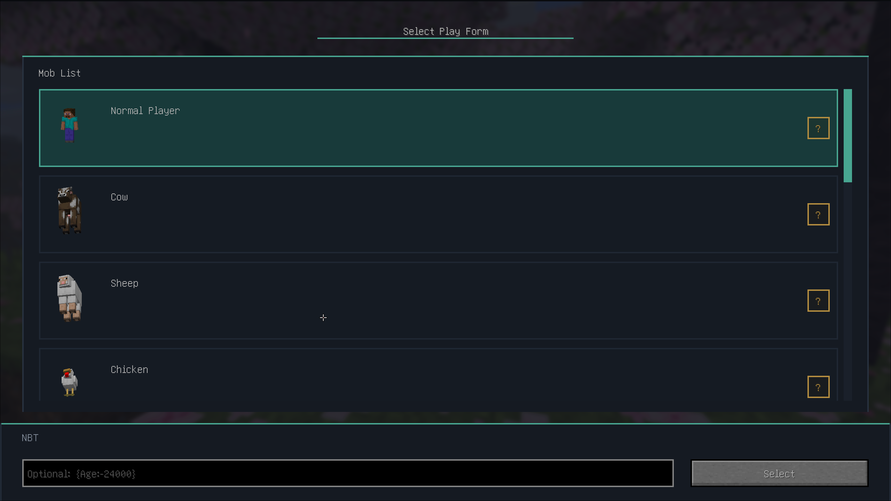
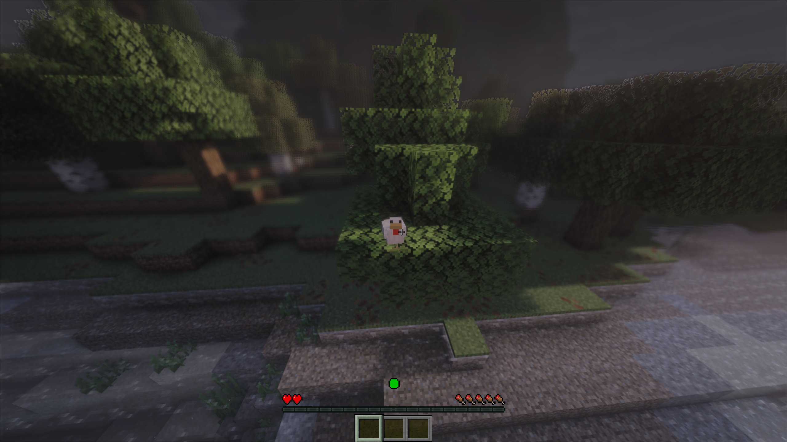
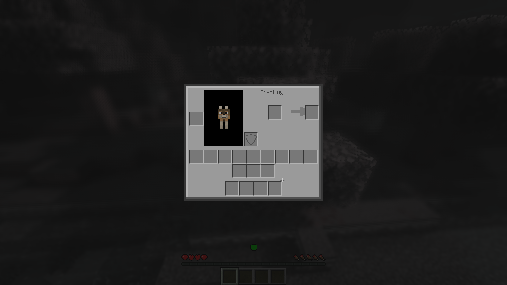
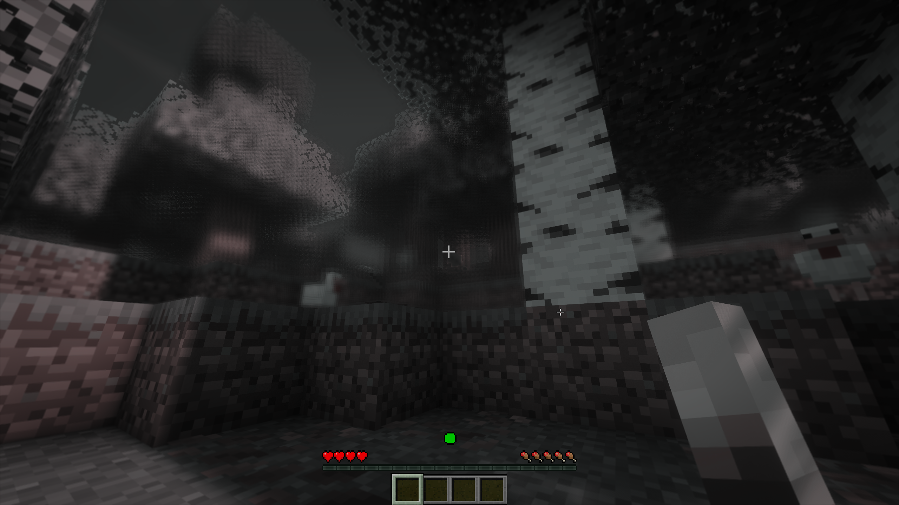

# Mob Life

Mob Life is a Fabric mod that makes you play as the mob form you choose when you create a world.
It changes more than the model: movement, hitbox, eye height, vision, food, equipment, crafting, sleep, and combat all adapt to the selected body.

Japanese version: [日本語版はこちら](docs/README_jp.md)

## Screenshots

The screenshots below are shown at a smaller size so the page stays readable.
Each caption names the situation shown in the image.

**World creation form selection**

<figure>
  
  <figcaption>The form picker shown during world creation.</figcaption>
</figure>

**Third-person morph view**

<figure>
  
  <figcaption>A mob form viewed from third person after morphing.</figcaption>
</figure>

**Inventory and crafting layout**

<figure>
  
  <figcaption>The inventory screen with reduced slots and form-specific layout changes.</figcaption>
</figure>

**Vision effect**

<figure>
  
  <figcaption>The low-saturation vision effect used by mob forms.</figcaption>
</figure>

## What it does

- Lets you choose your starting form during world creation.
- Stores that choice with the world so it becomes part of the save.
- Adjusts the initial spawn point so the chosen form can begin in a valid place.
- Supports player, cow, sheep, chicken, cat, ocelot, wolf, pig, horse, donkey, mule, and rabbit forms.
- Changes size, eye height, movement feel, sounds, and visual tint to match the form.
- Changes inventory capacity and available equipment slots by form.
- Lets data packs adjust the behavior of each form.
- Reads global options from `config/mob_life.json`, with a Mod Menu screen when the mod is installed.

## Why it is different

Mob Life is not just a visual morph mod.
It is built around the idea that each form should play differently.

Many morph mods focus on appearance or on copying a few abilities. Mob Life goes further: form-specific movement, jumping, reach, mining, inventory size, equipment, food, sleep, vision, and combat are all part of the design.

The world-creation choice is also important.
The form you pick becomes part of that world's identity, rather than a temporary disguise you switch into later.
You can still change forms with `/moblife morph`, but the starting choice sets the tone for the world.

## Playing the mod

- Pick a form when you create a new world.
- Play with the movement, vision, food, equipment, and crafting rules that match that form.
- Use `/moblife morph` to change forms later if you want to try another body.
- Use data packs or `config/mob_life.json` to tune the defaults.

## Forms

The built-in starting forms are:

- Player
- Cow
- Sheep
- Chicken
- Cat
- Ocelot
- Wolf
- Pig
- Horse
- Donkey
- Mule
- Rabbit

## Configuration

Per-form defaults live at `data/mob_life/mob_life/morphs/<mob>.json`.
Data packs can override the same path to change movement, vision, food, combat, inventory, sleep, and traits for each form.
Running `/reload` reapplies the active configuration.

Global settings live in `config/mob_life.json`.
That file controls the handling of normal-player morphs, rendering, inventory limits, mining and reach changes, and awkwardness debug text.

## Requirements

- Minecraft 26.1.2
- Fabric Loader 0.19.3
- Java 25
- Fabric API

## License

Mob Life is released under the [MIT License](LICENSE).
